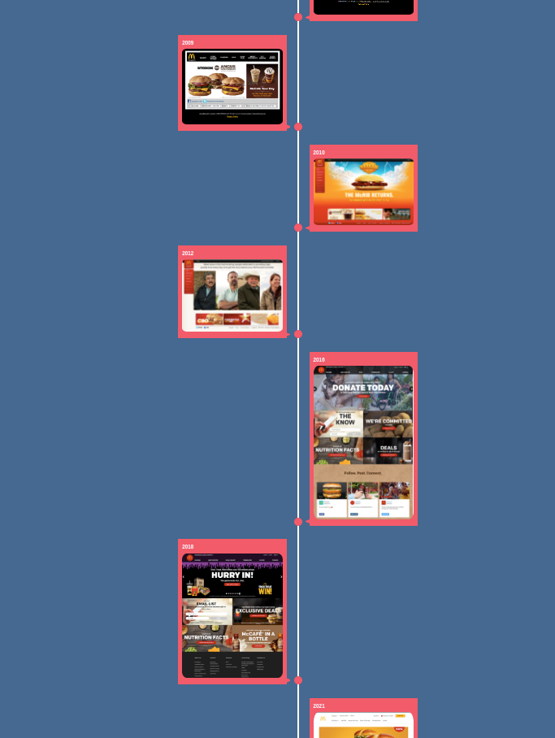

# Mcdonald Website Timeline

## Link

- Live Site URL: [https://harshita1225.github.io/mcdonald-website-timeline/](https://harshita1225.github.io/mcdonald-website-timeline/)

### Project Specifications

- create a timeline structure using css

- making the design responsive
- adding images at each timeline making them responsive
- creating lazy loading effect to display each content using innerwidth and clientHeight

### Screenshot

#### Desktop Version

- slide1
  

- slide2
  
- slide3
  

### Built with

- Semantic HTML5 markup
- CSS
- Flex box
- Responsive design
- Animations
- Desktop layout

## Author

- Website - [Harshita Joshi-Github](https://github.com/harshita1225)
